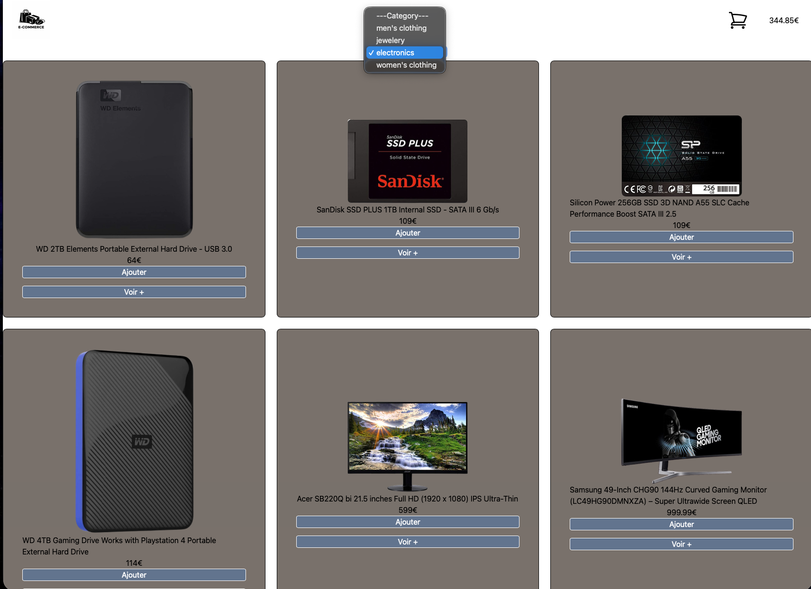
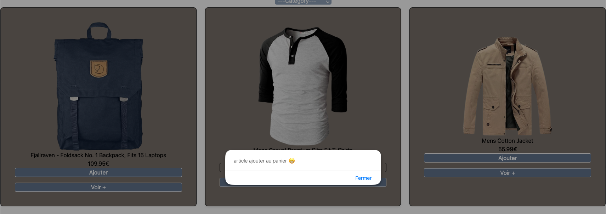
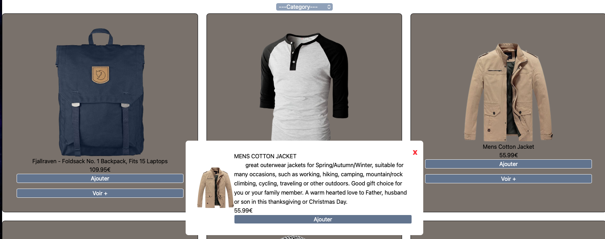
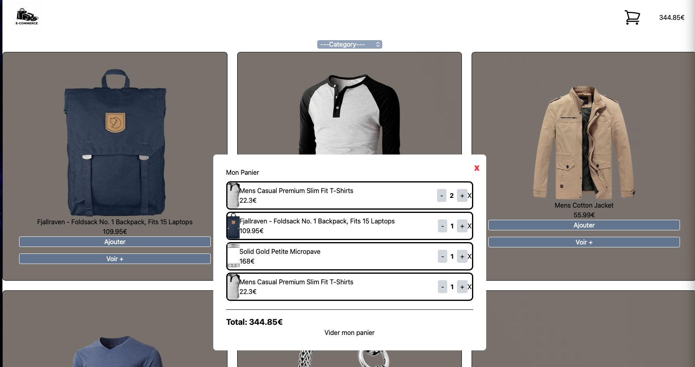

# 🛍️ Clothing store - React app

Application web développée avec React permettant d’afficher une liste de produits,
de filtrer par catégorie et d’ajouter des articles à un panier sauvegardé en local.

## Fonctionnalités ✅
- ✅ Affichage des produits depuis une API
- ✅ Filtrage par catégories
- ✅ Ajout/suppression d'articles au panier
- ✅ Gestion des quantités (augmenter/diminuer)
- ✅ Calcul du total dynamique
- ✅ Persistance avec localStorage
- ✅ Modal détails produit
- ✅ Modal panier
- ✅ Design responsive (mobile/tablet/desktop)

## Technologies 👨🏾‍💻

- **React 18** - Framework JavaScript
- **Tailwind CSS** - Styling
- **FakeStore API** - Données produits
- **localStorage** - Persistance données
- **Vite** - Build tool


## 🎯 Compétences démontrées

### React
- Hooks (useState, useEffect, useMemo)
- Gestion d'état complexe
- Props et communication entre composants
- Rendu conditionnel
- Gestion d'événements

### JavaScript
- Array methods (map, filter, reduce, find)
- Spread operator
- Destructuring
- Async/Await
- LocalStorage API

### CSS/UI
- Tailwind CSS
- Grid & Flexbox
- Design responsive
- Modals
- Animations et transitions


## 📦Installation
```bash
#1. Cloner le projet

git clone https://github.com/clementR97/AppBoutique.git
cd AppBoutique

#2. Installer les dépendances
npm install

#3. Lancer le serveur
npm run dev

le projet sera accessible sur `http://localhost:5173`
```
## 👤 Auteur

**Clément Roland**

- GitHub: [@clementR97](https://github.com/clementR97)
- LinkedIn: [Clément Roland](https://linkedin.com/in/roland-971)

---

## 📝 Licence

Ce projet est sous licence MIT.


##📸Screen-Shoot

### Page d'accueil


### Page d'accueil clique category


### alert ajout d'article


### modal a propos


### modal panier


